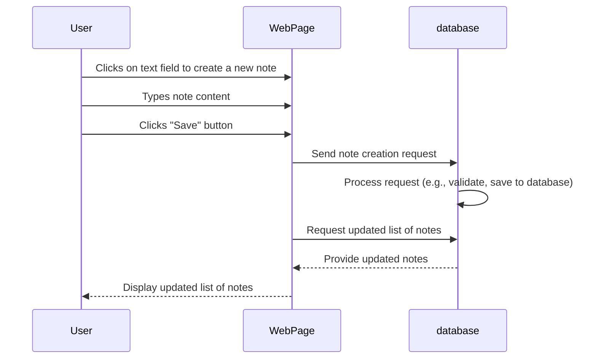

```mermaid

 sequenceDiagram
    participant User
    participant WebPage
    participant database

    User->>WebPage: Clicks on text field to create a new note
    User->>WebPage: Types note content
    User->>WebPage: Clicks "Save" button

    WebPage->>database: Send note creation request
    database->>database: Process request (e.g., validate, save to database)

    WebPage->>database: Request updated list of notes
    database-->>WebPage: Provide updated notes
    WebPage-->>User: Display updated list of notes 
```
